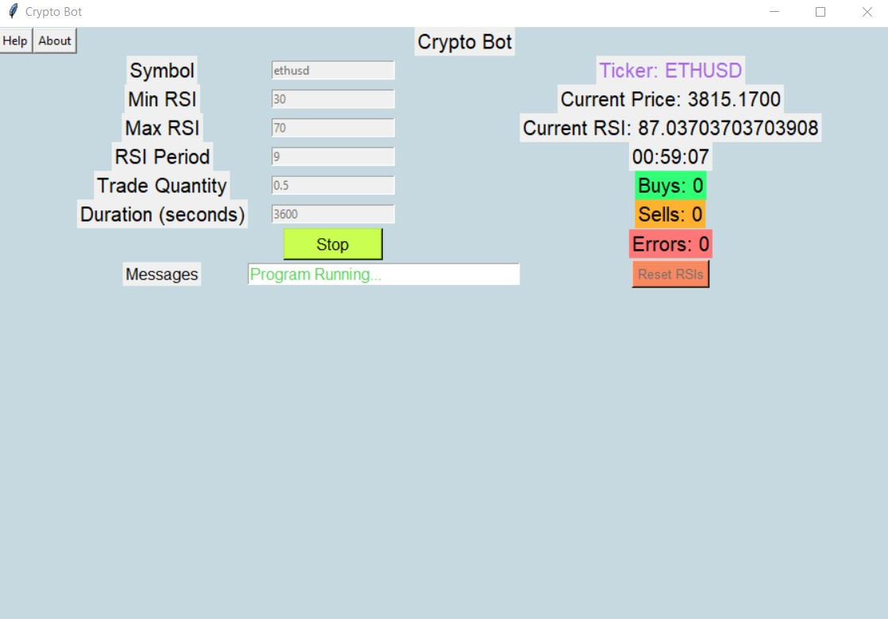

# Crypto Trading Bot

A trading bot that has been tested and works for Binance.US.

The buy and sell logic was made with the help of this great video:
<a href="https://www.youtube.com/watch?v=GdlFhF6gjKo">Video</a>

## Required Libraries Before Use
<ul>
<li>python-binance</li>
<li>TA-Lib</li>
<li>websocket-client</li>
<li>numpy</li>
</ul>

Image of Ethereum order execution on Binance.US from bot

Image of orders logged to text file

## Program Images

Main Program

Help Page

